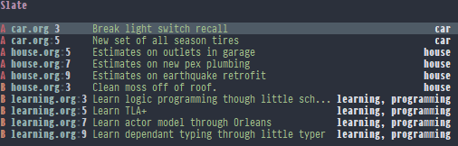

# Table of Contents

1.  [Slate](#org0a8b36a)
    1.  [Overview](#org8955bca)
    2.  [Usage](#org4b7a5eb)
    3.  [Installation](#org0fbe6b6)

# Slate

Figure out what you have slated&#x2026;..

## Overview

Slate is an app built in emacs that gathers TODO entries from a directory of org files. It does this using rg so many files can quickly be scanned.

The list can be incrementally filtered down by typing and hitting enter will take you to the selected TODO entry.

The list is ordered by priority and contains priority, file name, line number, the text, and tags.

## Usage

Slate can be started by calling slate. If you want to refresh the list call slate-refresh.

## Installation

Slate requires that rg be installed. Once rg is installed it can be installed with straight like:

    (use-package slate
      :defer t
      :straight (slate :type git :host github :repo "jonathanhope/slate")
      :commands (slate slate-refresh))
